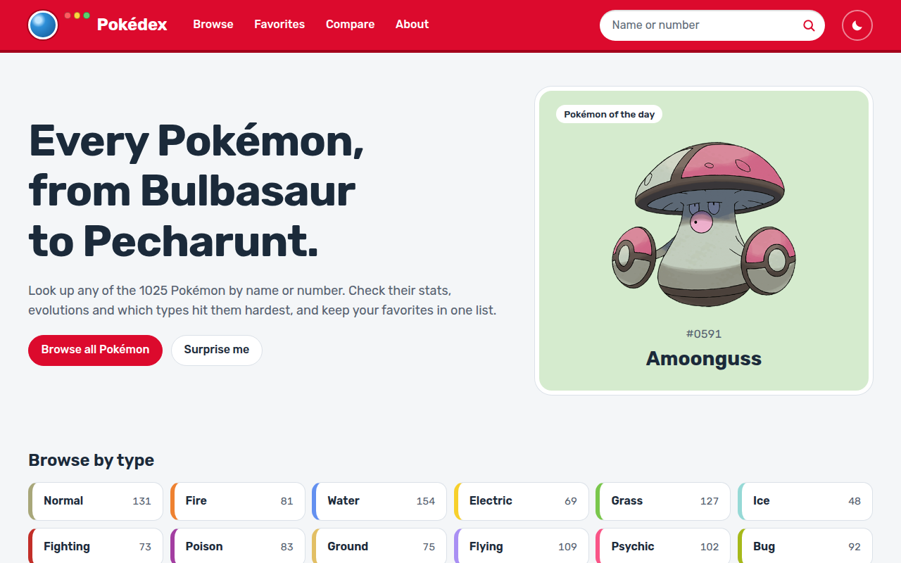
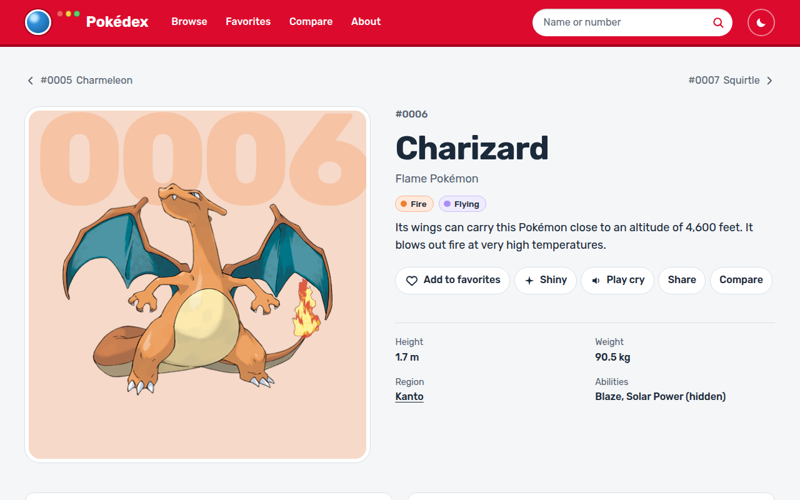
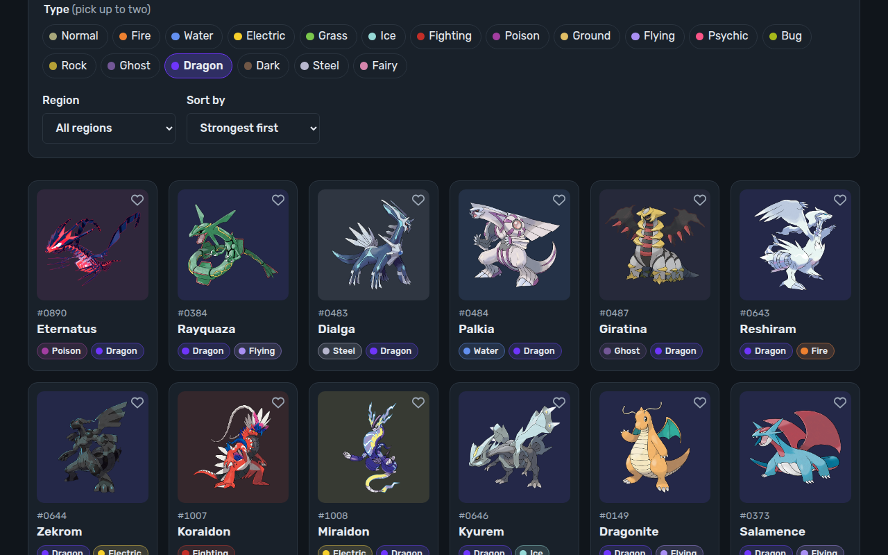

# Pokédex

[](https://github.com/AkosKappel/Pokedex/actions/workflows/deploy.yml)
[](LICENSE)

A fast Pokédex for all 1025 Pokémon. Search by name or number, filter by type and region, and see each Pokémon's stats, type matchups, evolution chain and other forms.

**Live demo:** https://akoskappel.github.io/Pokedex/



| Pokémon page                                 | Browse in dark mode                                             |
| -------------------------------------------- | --------------------------------------------------------------- |
|  |  |

## Features

- **Search** by name or number from any page, with suggestions. Accents and punctuation do not matter (`flabebe`, `mr mime`).
- **Browse** with type filters (up to two), region filter and sorting by number, name or base stat total. Filters and pages live in the URL, so every view can be shared.
- **Pokémon pages** with artwork (normal and shiny), description, height and weight, abilities, base stats, weaknesses and resistances, evolution chain with conditions, other forms, cries and sharing.
- **Compare** up to three Pokémon side by side.
- **Favorites** saved in the browser.
- **Dark mode**, keyboard shortcuts (<kbd>/</kbd> for search, <kbd>←</kbd> <kbd>→</kbd> on a Pokémon page), installable and usable offline after the first visit.

## Stack

| Area      | Choice                                                                   |
| --------- | ------------------------------------------------------------------------ |
| Framework | Vue 3.5 (Composition API, `<script setup>`), Vue Router 5                |
| Language  | TypeScript 6, strict                                                     |
| Build     | Vite 8, `vite-plugin-pwa` (Workbox service worker)                       |
| Styling   | Plain CSS with custom properties and `light-dark()`, Rubik variable font |
| Tests     | Vitest, Playwright with axe-core, Lighthouse CI                          |
| Hosting   | GitHub Pages, deployed by GitHub Actions                                 |

## Data

All data comes from [PokéAPI](https://pokeapi.co/).

- `src/data/pokedex.json` is a snapshot of every species (number, name, region, types, base stat total) taken from the PokéAPI GraphQL endpoint. It ships with the app, so search, filters and sorting need no requests. Refresh it with `npm run data` when new Pokémon are released.
- Details (stats, abilities, descriptions, evolutions) load from the PokéAPI REST endpoints when a Pokémon is opened. The service worker caches responses and artwork for 30 days.
- The type chart in `src/lib/types.ts` is the generation 6+ chart, checked against PokéAPI's damage relations.

## Getting started

Requires Node.js 24 (see `.nvmrc`).

```bash
npm install
npm run dev
```

The app runs at http://localhost:5173/Pokedex/.

## Scripts

| Command                           | What it does                                                                 |
| --------------------------------- | ---------------------------------------------------------------------------- |
| `npm run dev`                     | Development server                                                           |
| `npm run build`                   | Type check, production build, then `scripts/prerender.js`                    |
| `npm run preview`                 | Serve the production build                                                   |
| `npm run typecheck`               | `vue-tsc`                                                                    |
| `npm run lint`                    | ESLint                                                                       |
| `npm run format` / `format:check` | Prettier                                                                     |
| `npm test`                        | Unit tests (Vitest)                                                          |
| `npm run test:e2e`                | End-to-end and accessibility tests (Playwright, needs `npm run build` first) |
| `npm run lighthouse`              | Lighthouse CI on the built site                                              |
| `npm run data`                    | Refresh `src/data/pokedex.json` from PokéAPI                                 |

## Deployment

Every push to `main` runs `.github/workflows/deploy.yml`: format check, lint, type check, unit tests, build, end-to-end tests and Lighthouse, then deploys `dist/` to GitHub Pages.

GitHub Pages serves static files only. `scripts/prerender.js` writes an HTML file for each route (including all 1025 Pokémon pages) with its own title, description and link preview, plus `404.html` as the single-page-app fallback, `sitemap.xml` and `robots.txt`.

## Project structure

```
src/
  components/   Header, cards, stat bars, type matchups, evolution chain, ...
  data/         Bundled Pokédex index
  lib/          Data and logic: index search, API client, type chart, evolutions, favorites
  views/        One component per page
scripts/        Index snapshot and prerendering
test/e2e/       Playwright tests and PokéAPI fixtures
```

## License

[MIT](LICENSE). Pokémon and Pokémon character names are trademarks of Nintendo, Game Freak and Creatures. This is a fan project and is not affiliated with them.
